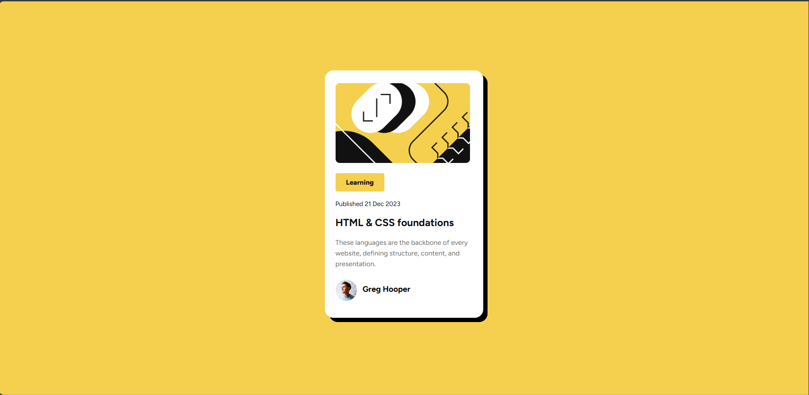

# Blog preview card solution

This is a solution to the [Blog preview card challenge on Frontend Mentor](https://www.frontendmentor.io/challenges/blog-preview-card-ckPaj01IcS). Frontend Mentor challenges help you improve your coding skills by building realistic projects. 

## Table of contents

- [Overview](#overview)
  - [The challenge](#the-challenge)
  - [Screenshot](#screenshot)
  - [Links](#links)
- [My process](#my-process)
  - [Built with](#built-with)
  - [What I learned](#what-i-learned)
  - [Continued development](#continued-development)
  - [Useful resources](#useful-resources)
- [Author](#author)
- [Acknowledgments](#acknowledgments)

## Overview

- This is a project that i have recently completed. The project is about building a "blog preview card" using HTML & CSS.

### The challenge

Users should be able to:

- See hover and focus states for all interactive elements on the page

### Screenshot

### Links

- Solution URL: [https://github.com/abdulkadir023/Blog-Preview-Card](https://github.com/abdulkadir023/Blog-Preview-Card)
- Live Site URL: [https://vercel.com/abdulkadir023s-projects/blog-preview](https://vercel.com/abdulkadir023s-projects/blog-preview)

## My process

### Built with

- Semantic HTML5 markup
- CSS custom properties
- Flexbox
- Mobile-first workflow

## Author

- Frontend Mentor - [@abdulkadir023](https://www.frontendmentor.io/profile/@abdulkadir023)

